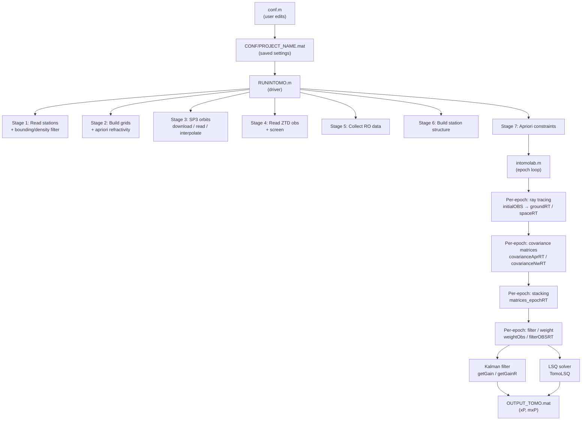

# INTOMO Overview

## What is INTOMO?

INTOMO (Integrated Tomography Model) v1.0 is a MATLAB library for three-dimensional GNSS troposphere tomography. It reconstructs the spatial distribution of atmospheric refractivity (wet or total) over a defined geographic domain by combining:

- **Ground-based GNSS observations** — Zenith Total Delay (ZTD) and horizontal gradients measured by a network of receivers. These are mapped to Slant Wet Delays (SWD) or Slant Total Delays (STD) through ray tracing.
- **Space-based Radio Occultation (RO) observations** (integrated mode) — Excess phase measurements from LEO/GPS satellite pairs (Level 1b, COSMIC/SPIRE format). These provide vertical refractivity profiles along the limb of the atmosphere.

The library was developed by Adam Cegla at Wroclaw University of Environmental and Life Sciences (Poland) as part of the NAWA OPUS project *"3D Integrated Sensing of the Troposphere Using Ground and Space-Based GNSS Observations"* (2020/37/B/ST10/03703).

The processing rests on the Radon transform framework: the path-integrated signal delays are expressed as linear combinations of refractivity values at grid nodes or voxel centres, forming the observation matrix **A**. Tomographic inversion of the accumulated system of equations over all epochs yields epoch-by-epoch refractivity fields.

## Architecture

The repository is split into two top-level directories.

### `RayTracer/`

Contains the physics-level 3-D ray tracing engine. It is independent of the tomographic inversion and can in principle be used standalone.

| Sub-folder | Purpose |
|-----------|---------|
| `Tomo_Fcn/` | Ray tracing calculations: voxel traversal, refractivity interpolation, excess phase, gradients |
| `Frgn_Fcn/` | Wrappers for aerospace/geodetic utilities (coordinate transforms, WGS-84, SP3 reader) |
| `Other_Fcn/` | Lightweight helpers: `select_id`, `savevar`, `vdistsum`, `vox_distance_cut` |
| `UndulationFiles/` | Geoid undulation data files loaded via `Undulation.m` |

### `Tomography/`

Contains the full GNSS tomography pipeline orchestrated by [`RUNINTOMO.m`](../Tomography/RUNINTOMO.m).

| Sub-folder | Purpose |
|-----------|---------|
| `CONF/` | Configuration artefacts: `conf.m`, `stations.txt`, undulation `.mat`, project `.mat` |
| `ENGINE/` | Core processing functions (ray tracing wrappers, Kalman/LSQ solvers, covariance builders) |
| `READ/` | Data readers for SP3, ZTD observations, RO NetCDF, station coordinates |
| `PPROCESS/` | Pre-processing: coordinate transforms, grid construction, apriori setup, screening |
| `WRITE/` | Output writers (currently empty) |
| `VISUAL/` | Visualisation functions (currently empty) |
| `External/` | Third-party MATLAB functions (GPT2, UNB3, VMF1, orbit utilities, etc.) |
| `DATA/` | Project data organised by project name (see [04-inputs.md](04-inputs.md)) |

## High-level pipeline

The diagram below shows the top-level control flow from configuration to final output.

## Key processing modes

The processing behaviour is controlled by the `switches` structure set in `conf.m`. The most important dimensions are:

| Dimension | Options | Description |
|-----------|---------|-------------|
| Observation sources | `integrated = 'yes'` / `'no'` | Include RO data in addition to ground GNSS |
| Grid parameterisation | `parametrization = 'constant'` / `'bilinear-h'` | Voxel-based constant value or bilinear node-based interpolation |
| Solution type | `solution = 'REAL'` / `'SYNTHETIC'` | Use real measured delays or generate synthetic ones |
| Inversion method | `method = 'KALMAN'` / `'LSQ'` | Kalman filter or Least Squares |
| Refractivity type | `totalN = true` / `false` | Total refractivity (Nh + Nw) or wet-only (Nw) |
| A priori model | `aprModel = 'ERA5'` / `'DETER'` | ERA5 reanalysis or deterministic GPT2/UNB3mm model |

For the full list of switches and their values see [03-configuration.md](03-configuration.md).

## References

Cegla, Adam, et al. "INTOMO operator for GNSS multi-source tomography based on 3D ray tracing technique." *Journal of Geodesy* 98.11 (2024): 101.

Cegla, Adam, et al. "Application of integrated GNSS tomography in observation study over the area of southern Poland." *Advances in Space Research* 74.8 (2024): 3654–3667.
