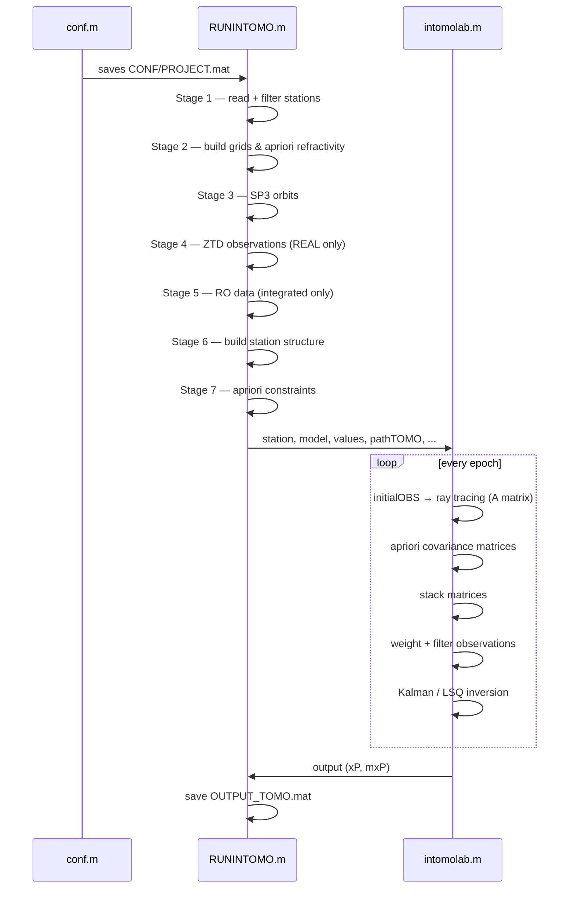

# Workflow

`RUNINTOMO.m` is the single driver script that orchestrates all processing. It is called after `conf.m` has been run (either manually or by the `conf;` call at the top of `RUNINTOMO.m`). Internally it calls `intomolab.m` for the epoch-by-epoch tomographic inversion.

---

## Stage overview



---

## Stage 1 — Read station coordinates and filter

**Script section:** `RUNINTOMO.m`, lines 16–41  
**Key functions:**

| Function | Location | Role |
|----------|----------|------|
| `readBLh` | `READ/readBLh.m` | Parse `stations.txt` → `NAME`, `BLh_ori` |
| `cspice_georec` | CSPICE MEX | Convert geodetic BLh to ECEF XYZ |
| `boundingTOMOLAB` | `PPROCESS/boundingTOMOLAB.m` | Remove stations outside the TOMO bounding box |
| `deleteStat` | `PPROCESS/deleteStat.m` | Thin the network by minimum inter-station distance (`switches.stat_range`) |

**Output variables:** `X`, `Y`, `Z`, `lat`, `lon`, `h`, `H`, `NAME`, `BLh`, `BLh_ori`

---

## Stage 2 — Build grids and a priori refractivity

**Script section:** `RUNINTOMO.m`, lines 43–146  
**Key functions:**

| Function | Location | Role |
|----------|----------|------|
| `time_listing` | `PPROCESS/time_listing.m` | Build `obs_set` (epoch matrices for TOMO, SP3, and METEO intervals) |
| `ERA5GridTOMO` | `ENGINE/ERA5GridTOMO.m` | Read ERA5 NetCDF, compute RT/TOMO grid coordinates, fill `model` with refractivity fields for each epoch |
| `pudel2` | `PPROCESS/pudel2.m` | Build 2-D arrays of voxel node/centre coordinates |
| `gridcalcRT` | `ENGINE/gridcalcRT.m` | Calculate refractivity values at grid nodes/centres |
| `Undulation.m` | `PPROCESS/Undulation.m` | Build undulation grid (first epoch only) |
| `distr_T_gpt2RT` | `External/` | GPT2 temperature distribution (DETER mode) |
| `distr_e_unb3RT` | `External/` | UNB3mm water vapour distribution (DETER mode) |
| `refcalc` | `RayTracer/Tomo_Fcn/refcalc.m` | Convert T/p/e to refractivity (total mode) |
| `eT2Nw` | `External/eT2Nw.m` | Convert vapour pressure and T to wet refractivity |

**Condition:** If `WORK/model.mat` already exists the grid computation is skipped and the file is loaded instead. This enables re-starting a run without re-computing the (expensive) ERA5 interpolation.

**Output variables:** `model` (see [07-data-structures.md](07-data-structures.md)), `obs_set`, `synthetic`, `apriori`

---

## Stage 3 — SP3 orbits

**Script section:** `RUNINTOMO.m`, lines 72–78  
**Key functions:**

| Function | Location | Role |
|----------|----------|------|
| `downloadORB` | `READ/downloadORB.m` | Download missing SP3 files via FTP from `igs.bkg.bund.de` |
| `readSP3dat` | `READ/readSP3dat.m` | Read all `.sp3` files from `pathORB` |
| `interSP3` | `PPROCESS/interSP3.m` | Interpolate satellite ECEF positions to tomography epoch times |

**Output variables:** `SP3Xn`, `SP3Yn`, `SP3Zn`, `PRNn`, updated `obs_set.observation_set_SP3`

---

## Stage 4 — Ground GNSS ZTD observations (REAL mode)

**Script section:** `RUNINTOMO.m`, lines 80–85 and 197–200  
**Condition:** `switches.solution = {'REAL'}`  
**Key functions:**

| Function | Location | Role |
|----------|----------|------|
| `readtxtOBS` | `READ/readtxtOBS.m` | Read ZTD, gradients, and their errors from daily `ATM/*.txt` files |
| `screenZTD` | `PPROCESS/screenZTD.m` | Filter stations with poor or missing ZTD observations |
| `pBLh2ZHDRT` | `PPROCESS/pBLh2ZHDRT.m` | Compute Zenith Hydrostatic Delay from pressure |

**Output variables:** `ZTDA`, `MZTDA`, `DGNA`, `MDGNA`, `DGEA`, `MDGEA`, `NAMES`, `ZHD`

---

## Stage 5 — Radio Occultation data (integrated mode)

**Script section:** `RUNINTOMO.m`, lines 148–155  
**Condition:** `switches.integrated = "yes"`  
**Key functions:**

| Function | Location | Role |
|----------|----------|------|
| `findRO` | `READ/findRO.m` | Match RO NetCDF files to epoch times, read excess phase and satellite/receiver coordinates |

**Output variable:** `cordRO` — a 3-D cell array indexed by `{epoch, ro_index, field}` where fields are: GPS coord, LEO coord, date, exL2, exLC

When `switches.integrated = "no"`, `cordRO` is set to `[]` and all RO code paths are bypassed.

---

## Stage 6 — Build the station structure

**Script section:** `RUNINTOMO.m`, lines 203–214  
**Key functions:**

| Function | Location | Role |
|----------|----------|------|
| `construct_station_LAB` | `ENGINE/construct_station_LAB.m` | Assemble the `station` structure per epoch from GNSS delays, satellite coordinates, and RO data |

**Condition:** If `WORK/station.mat` already exists it is loaded; otherwise `construct_station_LAB` is called and the result is saved.

**Inputs:** `model.BLh`, `model.BLH`, ZTD arrays, `PRNn`, `SP3Xn/Yn/Zn`, `obs_set.observation_set_SP3`, `model.cut_off_angle`, `cordRO`, `switches`, gradients  
**Output variable:** `station(t)` — structure array over epochs (see [07-data-structures.md](07-data-structures.md))

---

## Stage 7 — A priori constraints

**Script section:** `RUNINTOMO.m`, lines 216–291  
**Key functions:**

| Function | Location | Role |
|----------|----------|------|
| `aprioriCONSTRNWP` | `PPROCESS/aprioriCONSTRNWP.m` | Build the apriori observation vector and index arrays for inner and outer model regions |

**Logic:** Depending on `switches.aprModel` (`'DETER'` or `'ERA5'`) and `switches.parametrization` (`'constant'` or `'bilinear-h'`), the function maps epoch-wise refractivity values (`apriori.Nw_DETER_num` or `apriori.Nw_ERA5_num`) to the inner and outer voxel index sets.

**Output variables:** `values` structure containing `Nw_apr`, `num_Nw`, `Nw_obs`, `num_Nw_out`, `Nw_obs_out`, `Nw_out` (field names vary with parametrization suffix `_num`)

After this stage, `WORK/model.mat` is re-saved (overwriting the earlier file) with the full set: `model`, `station`, `values`, `pathTOMO`, `PATH_SAVE`, `obs_set`, `switches`, `apriori`, `PROJECT_NAME`.

---

## Stage 8 — Tomographic inversion (`intomolab.m`)

**Function:** [`Tomography/ENGINE/intomolab.m`](../Tomography/ENGINE/intomolab.m)  
**Called from:** `RUNINTOMO.m`, line 295

This function contains the main epoch loop. For each epoch it performs sub-steps 8a through 8e.

### 8a — Ray tracing matrices

**Function:** `initialOBS`

`initialOBS` is the gateway to the ray tracers. It checks whether `WORK/<amtrix>/amtrix_<epoch>.mat` already exists; if so it loads it (allowing interrupted runs to restart). Otherwise it calls:

| Function | Purpose |
|----------|---------|
| `spaceRT` | Trace RO signal paths through the 3-D voxel grid; fill `A_RO` matrix with path derivatives |
| `groundRT` | Trace each ground GNSS signal; fill `A` matrix with path derivatives |
| `voxel_dist_3D_combined` | Core 3-D ray propagation engine (in `RayTracer/Tomo_Fcn/`) |
| `interateModelsA` | Map ray path points to tomography voxel indices; compute voxel traversal distances |
| `bilinearRT` | Bilinear/spline interpolation of refractivity at ray points (bilinear-h mode) |
| `A_row_bilin_regRT` | Compute derivatives of spline basis functions for the A matrix (bilinear-h mode) |
| `perler_T` | Compute second-derivative spline matrix (bilinear-h mode) |

**Output:** `A`, `SWD`, `SIWV`, `R_SWD`, `R_SIWV`, `elev`, `SAT`, `station_name`, `coord`, `dSWD`

The matrices are saved to `WORK/<amtrix>/amtrix_<epoch>.mat` for each epoch.

### 8b — A priori covariance matrices

| Function | Purpose |
|----------|---------|
| `apConstRT` | Build the apriori observation vector and A row for inner/outer model |
| `covarianceAprRT` | Estimate initial state covariance from apriori variability |
| `covarianceNwRT` | Estimate dynamic process noise covariance Q |

### 8c — Stacking

**Function:** `matrices_epochRT`

Combines `A`, `A_apriori`, `A_constr`, `SWD`, `SWD_apriori`, `SWD_constr`, `P_apriori`, `P_constr` into the stacked system for the Kalman filter. In the default `stacking = {'NO'}` mode, only the current epoch contributes.

### 8d — Observation weighting and filtering

| Function | Purpose |
|----------|---------|
| `weightObs` | Calculate per-observation weights `P2` based on elevation, station quality, and residuals |
| `filterOBSRT` | Remove outlier observations exceeding a defined threshold in `R_SWD` |
| `Adecor` | Remove linearly dependent rows from A (only when `switches.decorelation = {'YES'}`, not tested) |

### 8e — Kalman filter or LSQ inversion

**Kalman (`switches.method = {'KALMAN'}`):**

For the first epoch a zero-start Kalman filter is initialised with `Pzero` from `covarianceAprRT`. For subsequent epochs the state transition matrix `Phi` is derived as the ratio of successive apriori refractivity values.

| Function | Purpose |
|----------|---------|
| `getGain` | Standard Kalman gain with SVD (using `svdecon.m`) |
| `getGainR` | Robust Kalman gain with IGGIII downweighting (when `switches.filter = {'ROBUST'}`) |

Per-epoch Kalman diagnostics (`thin` struct) are saved to `PATH_SAVE/<PROJECT_NAME>/KAL/kalman_mat_<epoch>.mat`.

**LSQ (`switches.method = {'LSQ'}`):**

| Function | Purpose |
|----------|---------|
| `TomoLSQ` | Least Squares inversion of the stacked system; returns `xP`, `mxP`, `dxP` |

---

## Stage 9 — Save final output

**Script section:** `RUNINTOMO.m`, line 299

```matlab
save([PATH_SAVE,'\',PROJECT_NAME,'\OUT\OUTPUT_TOMO.mat'],'output')
```

Saves the `output` structure (containing `xP` and `mxP`) to `PATH_EXTERNALSAVE/<PROJECT_NAME>/OUT/OUTPUT_TOMO.mat`.

See [06-outputs.md](06-outputs.md) for the full description of all output files.
